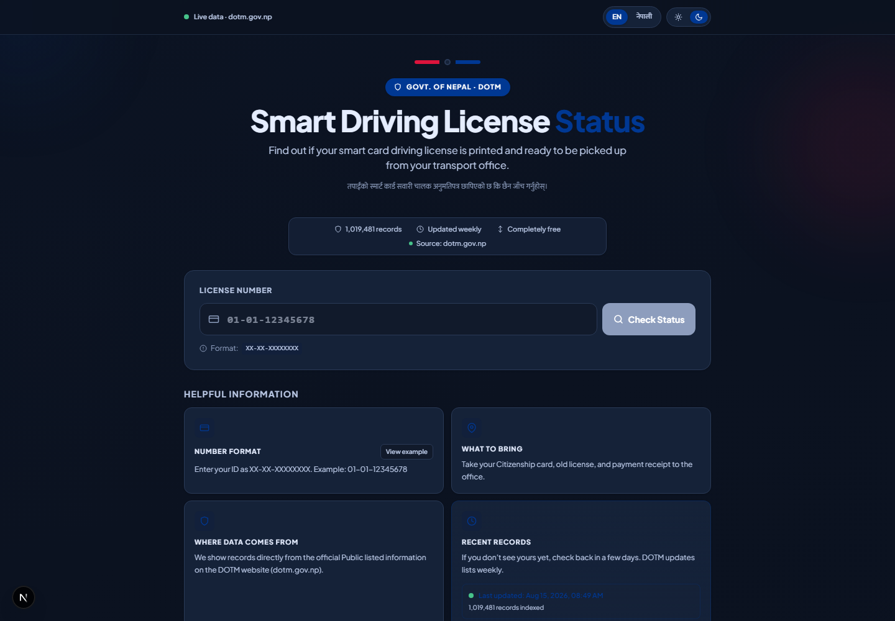

# Nepal License Checker 🇳🇵

Instantly check whether your **Nepal smart card driving license** has been printed by the **Department of Transport Management (DOTM)** and is ready to collect — for free, in English and नेपाली.

> This site is **not** the official source. Data is mirrored from [dotm.gov.np](https://dotm.gov.np) and updated regularly.



## Features

- **Instant status lookup** — enter your license number (`XX-XX-XXXXXXXX`) and get a "Ready" / "Not Ready" result in seconds
- **Smart input** — hyphens are inserted automatically as you type, with inline validation and progress feedback
- **Bilingual UI** — full English ⇄ नेपाली switching (`?lang=ne` is also URL-selectable)
- **Light & dark themes** — saved to localStorage and respects `prefers-color-scheme`
- **100K+ indexed records** — fast lookups served from a Turso (LibSQL) database
- **Live DOTM fallback** — if a number isn't in the database, the API scrapes the latest DOTM published PDFs on the fly and caches the result
- **Weekly data sync** — a GitHub Actions cron keeps the indexed list fresh
- **SEO-ready** — structured data (FAQPage, HowTo, GovernmentService), sitemap, and bilingual canonical links

## How it works

1. **Fast path:** the requested number is matched against the Turso database of indexed printed records.
2. **Live path:** on a miss, the API downloads the DOTM printed-license PDFs, extracts text, and searches for the number.
3. **Newly found licenses** are upserted back into the database so repeat lookups are instant.

## Tech stack

- **Framework:** Next.js 16 (App Router) · React 19 · TypeScript
- **Styling:** Tailwind CSS v4
- **Database:** Turso (LibSQL) via `@libsql/client`
- **Scraping:** custom DOTM scraper (`scripts/scraper.js`) using Axios + Cheerio + PDF text extraction
- **Deployment:** Vercel (`vercel.json` extends API function duration)

## Getting started

### Prerequisites

- Node.js 20+
- A Turso database (free tier works)

### 1. Install dependencies

```bash
npm install
```

### 2. Set environment variables

Copy `.env.example` to `.env` and fill in:

| Variable | Description |
| --- | --- |
| `TURSO_DATABASE_URL` | Turso database URL (required) |
| `TURSO_AUTH_TOKEN` | Turso auth token (required) |
| `CRON_SECRET` | Secret used to protect the cron endpoint |
| `NEXT_PUBLIC_SITE_URL` | Public site URL (optional; defaults to the Vercel domain) |

### 3. Run the dev server

```bash
npm run dev
```

Open [http://localhost:3000](http://localhost:3000).

### 4. Build & lint

```bash
npm run build
npm run lint
```

## Syncing the license data

The DOTM printed-license list is refreshed by the scraper:

```bash
npm run cron:scrape        # fetch and upsert the latest DOTM PDFs into Turso
```

### GitHub Actions cron

`.github/workflows/dotm-scraper-cron.yml` runs the scraper automatically on a schedule (`0 2 15 2,5,8,11 *`) and can also be triggered manually from the **Actions** tab.

Set the following in the repo (as secrets or variables, optionally under the `Production` environment):

- `TURSO_DATABASE_URL`
- `TURSO_AUTH_TOKEN`

## API

### `GET /api/license?number=XX-XX-XXXXXXXX`

Checks a license number against the indexed database, then falls back to a live DOTM scrape.

- `200` — `{ status: 'success', source: 'database' | 'live', data: { license_number, holder_name, office, category, createdAt, updatedAt } }`
- `200` — `{ status: 'success', data: null }` when the license isn't in any printed list
- `400` — invalid or missing `number`
- `429` — rate limited (15 requests per minute per IP, in-memory)

### `GET /api/meta`

Returns index metadata (`lastUpdated`, `totalRecords`) for display on the home page.

## Project structure

```
src/
  app/                 # Next.js App Router (pages, API routes)
    api/
      license/         # license status lookup (DB + live scrape)
      meta/            # index metadata
      cron/            # protected scraper trigger endpoint
  components/          # LicenseForm, LicenseResult
  lib/                 # turso, i18n, rate limiting, site URL
  types/               # shared TypeScript types
  utils/               # validation, sanitization, helpers
scripts/
  scraper.js           # DOTM PDF scraper
  update-data.js       # scraper runner (used by cron)
```

## License

This project is provided as-is for personal and educational use.